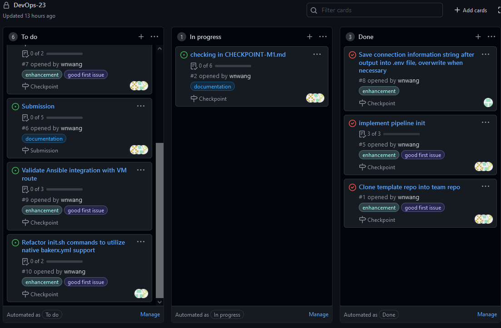

# CHECKPOINT-M1: Project M1 - Pipelines

## Current Progress
TODO

## Team Contributions
TODO

## Completed Work
|Issue/Task Description | Issue Number | Status | Overview |
|----|----|----|----|
|Clone template repo into team repo | [#1](https://github.ncsu.edu/CSC-DevOps-S22/DEVOPS-23/issues/1) | Closed | A skeleton template for the project was provided. The template repo was cloned and redirected to the team's repo ([DEVOPS-23](https://github.ncsu.edu/CSC-DevOps-S22/DEVOPS-23))|
|Implement pipeline init | [#5](https://github.ncsu.edu/CSC-DevOps-S22/DEVOPS-23/issues/5) | Closed | bakerx was used to provision the VM. An Ubuntu "focal" 20.04 base image was used. The following information is provided as output and stored for connected VM: user, ip address, path of ssh key. 
|Save connection information after output into .env file | [#8](https://github.ncsu.edu/CSC-DevOps-S22/DEVOPS-23/issues/8) | Closed | Save connection information string after output into .env file, overwrite when necessary. |

## Issues Faced
TODO

## Remaining Work
|Issue/Task Description | Issue Number | Status | Overview |
|----|----|----|----|
|Design and create b;uild job specification | [#7](https://github.ncsu.edu/CSC-DevOps-S22/DEVOPS-23/issues/7) | Open | Identify list of require package and version. Specify env. file requirements |
|Validate Ansible integration with VM route | [#9](https://github.ncsu.edu/CSC-DevOps-S22/DEVOPS-23/issues/9) | Open | Integrate the following commands: sudo add-apt-repository ppa:ansible/ansible, sudo apt-get update, sudo apt-get install ansible -y| 
|Refactor init.sh commands to utilize native bakerx.yml support | [#10](https://github.ncsu.edu/CSC-DevOps-S22/DEVOPS-23/issues/10) | Open |  Refactor init.sh provisioning commands into bakerx.yml, Update init.sh to run bakerx run and keep pipe output grep for connection information

## GitHub Project - Kanban Board

